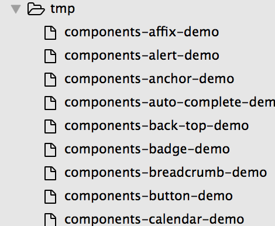
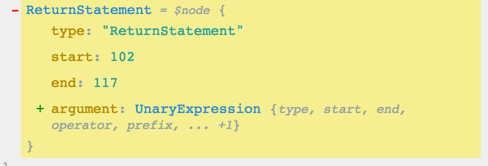
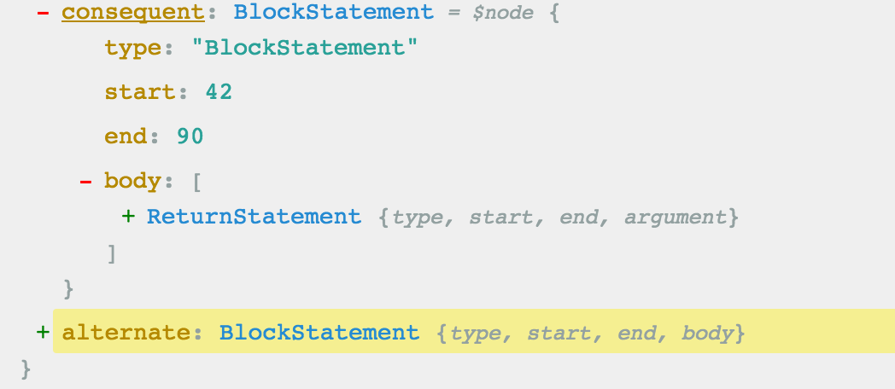
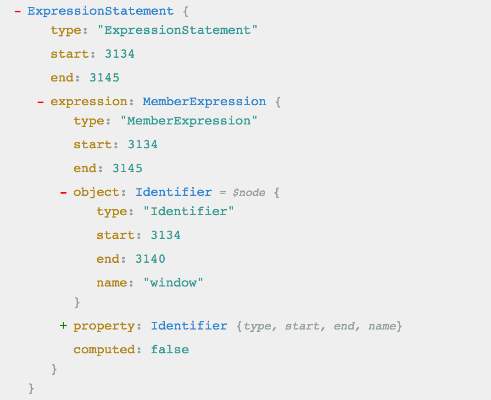
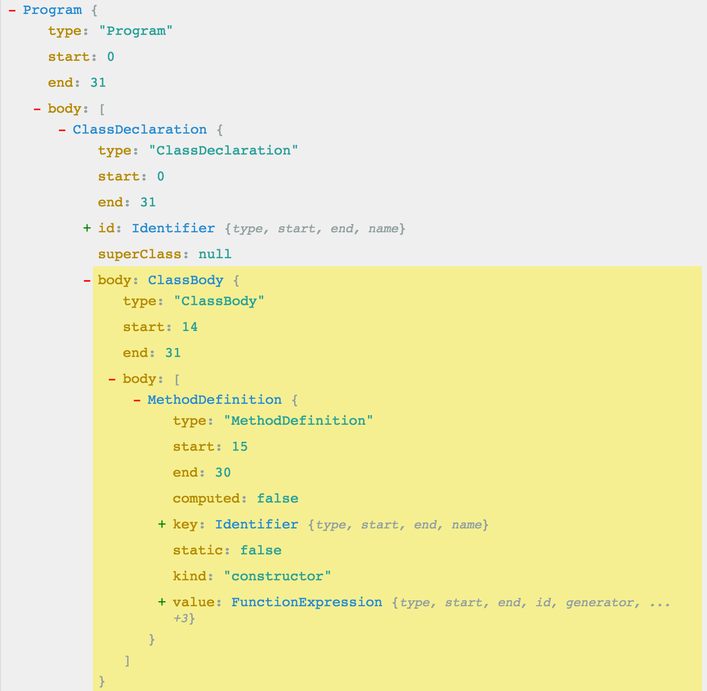

我都不知道为什么要仔细分析这背后的逻辑，可能是因为bisheng.js在ant design中出色的表现吧

### 1.npm start背后的逻辑

#### 1.1 源码分析部分
执行bisheng start执行的就是下面的代码逻辑
```js
exports.start = function start(program) {
  const configFile = path.join(process.cwd(), program.config || 'bisheng.config.js');    
  const config = getConfig(configFile);
  mkdirp.sync(config.output);

  const template = fs.readFileSync(config.htmlTemplate).toString();
  const templatePath = path.join(process.cwd(), config.output, 'index.html');
  fs.writeFileSync(templatePath, nunjucks.renderString(template, { root: '/' }));
  generateEntryFile(config.theme, config.entryName, '/');
  const doraConfig = Object.assign({}, {
    cwd: path.join(process.cwd(), config.output),
    port: config.port,
  }, config.doraConfig);
  doraConfig.plugins = [
    [require.resolve('dora-plugin-webpack'), {
      //获取webpack基础配置并更新;手动调用webpack开始编译文件，把静态资源吐给服务器;监听文件变化
      disableNpmInstall: true,
      cwd: process.cwd(),//在'middleware.before'中会默认读取cwd下的配置文件webpack.config.js
      config: 'bisheng-inexistent.config.js',//但是在这里就是读取我们的'bisheng-inexistent.config.js'
    }],
    [path.join(__dirname, 'dora-plugin-bisheng'), {
      config: configFile,
    }],
   
    require.resolve('dora-plugin-browser-history'),
  ];
  const usersDoraPlugin = config.doraConfig.plugins || [];
  doraConfig.plugins = doraConfig.plugins.concat(usersDoraPlugin);
 //其中涉及webpack生命周期的那些方法值得好好研究
  if (program.livereload) {
    doraConfig.plugins.push(require.resolve('dora-plugin-livereload'));
  }
  dora(doraConfig);
};
```

其实里面的代码逻辑都是很简单的，就是加载特定的配置文件bisheng.config.js
```js
 const configFile = path.join(process.cwd(), program.config || 'bisheng.config.js');
  const config = getConfig(configFile);
```

然后生成一个临时目录，用于存放我们的routes.js表示项目的路由，其需要theme，因为我们所有的文件都是存放在theme目录下的，这也是为什么ant-design中必须有theme目录;同时也生成一个entry.index.js，其表示的是我们的ReactRouter配置内容，其需要我们传入routes.js，因为要通过它获取到的相应的组件去实例化。

那么我们为什么可以处理markdown文件呢？其实这要从我们配置的dora插件来分析，首先我们看看最重要的一个插件：
```js
[path.join(__dirname, 'dora-plugin-bisheng'), {
      config: configFile,
    }]
```

我们看看在这个插件里面做了什么
```js
'use strict';
const updateWebpackConfig = require('./utils/update-webpack-config');
module.exports = {
  'webpack.updateConfig'(webpackConfig) {
    return updateWebpackConfig(webpackConfig, this.query.config);
  },
};
```

是不是很简单，但是我们一定要注意，这里我们是配置的`'webpack.updateConfig'`,其会在`dora-plugin-webpack`被实例化的时候调用（注意，webpack.updateConfig必须是一个函数），调用的时候会传入我们的webpackConfig对象和我们自己指定的配置文件，很显然，在这里就是bisheng.config.js文件。是不是已经等不及看看我们的updateWebpackConfig函数到底是如何处理的？

```js
const bishengLib = path.join(__dirname, '..');
const bishengLibLoaders = path.join(bishengLib, 'loaders');
module.exports = function updateWebpackConfig(webpackConfig, configFile, isBuild) {
  const config = getConfig(configFile);
  webpackConfig.entry = {};
  if (isBuild) {
    webpackConfig.output.path = config.output;
  }
  webpackConfig.output.publicPath = isBuild ? config.root : '/';
  webpackConfig.module.loaders.push({
    test(filename) {
      return filename === path.join(bishengLib, 'utils', 'data.js') ||
        filename === path.join(bishengLib, 'utils', 'ssr-data.js');
    },
    loader: `${path.join(bishengLibLoaders, 'bisheng-data-loader')}` +
      `?config=${configFile}&isBuild=${isBuild}`,
  });
  webpackConfig.module.loaders.push({
    test: /\.md$/,
    exclude: /node_modules/,
    loaders: [
      'babel',
      `${path.join(bishengLibLoaders, 'markdown-loader')}` +
        `?config=${configFile}&isBuild=${isBuild}`,
    ],
  });
  const pluginsConfig = resolvePlugins(config.plugins, 'config');
  pluginsConfig.forEach((pluginConfig) => {
    require(pluginConfig[0])(pluginConfig[1]).webpackConfig(webpackConfig, webpack);
  });
  const customizedWebpackConfig = config.webpackConfig(webpackConfig, webpack);
  const entryPath = path.join(bishengLib, '..', 'tmp', 'entry.' + config.entryName + '.js');
  if (customizedWebpackConfig.entry[config.entryName]) {
    throw new Error('Should not set `webpackConfig.entry.' + config.entryName + '`!');
  }
  customizedWebpackConfig.entry[config.entryName] = entryPath;
  return customizedWebpackConfig;
};
```

其中调用updateWebpackConfig的第三个参数是我们的isBuild参数,他会决定以下的内容：

```js
  if (isBuild) {
    //如果isBuild为true，那么更新webpack.output.path为配置文件的output属性
    //否则还是使用webpack.out.path默认的值
    webpackConfig.output.path = config.output;
  }
  webpackConfig.output.publicPath = isBuild ? config.root : '/';
  //如果是isBuild，那么output.pulicPath为配置文件的root值，否则输出路径为'/'
  webpackConfig.module.loaders.push({
    test(filename) {
      return filename === path.join(bishengLib, 'utils', 'data.js') ||
        filename === path.join(bishengLib, 'utils', 'ssr-data.js');
    },
    loader: `${path.join(bishengLibLoaders, 'bisheng-data-loader')}` +
      `?config=${configFile}&isBuild=${isBuild}`,
  });
  webpackConfig.module.loaders.push({
    test: /\.md$/,
    exclude: /node_modules/,
    loaders: [
      'babel',
      `${path.join(bishengLibLoaders, 'markdown-loader')}` +
        `?config=${configFile}&isBuild=${isBuild}`,
    ],
  });
//我们还需要把isBuild的值传入到各种loader中
```

总之，*如果isBuild为true，那么我们才会更新webpack的输出路径为我们的configFile文件指定的配置的值*。对于相应的文件的路径我们也做如下的说明：

```js
const bishengLib = path.join(__dirname, '..');
const bishengLibLoaders = path.join(bishengLib, 'loaders');
```

也就是说我们的bishengLib就是指的bisheng这个module的lib目录，而bishengLibLoaders就是lib下的loaders文件夹！这里处理markdown文件引入了两个loader，分别为`'bisheng-data-loader'`和`'markdown-loader'`。

### 1.2 bisheng.js中的loader分析
#### 1.2.1 bisheng-data-loader分析
首先我们来分析下bisheng-data-loader这个loader:

```js
'use strict';
const fs = require('fs');
const path = require('path');
const loaderUtils = require('loader-utils');
const getConfig = require('../utils/get-config');
const markdownData = require('../utils/markdown-data');
const resolvePlugins = require('../utils/resolve-plugins');
module.exports = function bishengDataLoader(/* content */) {
  if (this.cacheable) {
    this.cacheable();//loader缓存
  }
  const webpackRemainingChain = loaderUtils.getRemainingRequest(this).split('!');
  const fullPath = webpackRemainingChain[webpackRemainingChain.length - 1];
  const isSSR = fullPath.endsWith('ssr-data.js');
 
  const query = loaderUtils.parseQuery(this.query);
  const config = getConfig(query.config);

  const markdown = markdownData.generate(config.source);
  //得到所有的source部分的markdown数据
  const browserPlugins = resolvePlugins(config.plugins, 'browser');
  //解析所有的浏览器的plugin，也就是解析的是每一个模块的lib/browser
  // const pluginName = path.join(snippets[0], 'lib', moduleName);
  const pluginsString = browserPlugins.map(
    (plugin) =>
      `require('${plugin[0]}')(${JSON.stringify(plugin[1])})`
  ).join(',\n');
 //加载所有的browser模块，并通过join方法来合并起来
  const picked = {};
  if (config.pick) {
    const nodePlugins = resolvePlugins(config.plugins, 'node');//解析node模块
    markdownData.traverse(markdown, (filename) => {
      const fileContent = fs.readFileSync(path.join(process.cwd(), filename)).toString();
      //得到文件的内容
      const parsedMarkdown = markdownData.process(filename, fileContent, nodePlugins, query.isBuild);
      //使用模块下面的node进行处理
      Object.keys(config.pick).forEach((key) => {
        if (!picked[key]) {
          picked[key] = [];
        }

        const picker = config.pick[key];
        const pickedData = picker(parsedMarkdown);
        //对于每一个picker中的方法都会传入已经解析好的markdown数据，把得到的结果作为picked传入到数组中返回
        if (pickedData) {
          picked[key].push(pickedData);
        }
      });
    });
  }
  //作为一个loader，我们必须按照指定的格式进行返回;但是必须是node的这种返回格式，也就是module.exports这种方式，这是CMD的方式
  return 'var Promise = require(\'bluebird\');\n' +
    'module.exports = {' +
    `\n  markdown: ${markdownData.stringify(markdown, config.lazyLoad, isSSR)},` +
    `\n  plugins: [\n${pluginsString}\n],` +
    `\n  picked: ${JSON.stringify(picked, null, 2)},` +
    `\n};`;
};
```

第一步：首先下面表示是否缓存：
```js
 if (this.cacheable) {
    this.cacheable();//loader缓存
  }
```

第二步：接着是判断是否是ssr,具体可以参考[ssr基本概念](http://www.tuicool.com/articles/iMfyqqF)。此处先不展开。可以参见bisheng-build内容
```js
   const webpackRemainingChain = loaderUtils.getRemainingRequest(this).split('!');
  const fullPath = webpackRemainingChain[webpackRemainingChain.length - 1];
  const isSSR = fullPath.endsWith('ssr-data.js');
```

我们来看看loaderUtils.getRemainingRequest方法的内容：
```js
function dotRequest(obj) {
  return obj.request;
}
exports.getRemainingRequest = function(loaderContext) {
  if(loaderContext.remainingRequest)
    return loaderContext.remainingRequest;
  var request = loaderContext.loaders.slice(loaderContext.loaderIndex+1).map(dotRequest).concat([loaderContext.resource]);
  return request.join("!");
};
```

如果loaderContext.remainingRequest存在，那么直接返回，否则按下面处理：
   loaderContext.loaders获取所有的loader,而loaderContext.loaderIndex是获取当前loader在这个集合中的位置，然后或者右侧的
   loader的request对象组成一个数组。同时和loaderContext.resource也就是这个loader的最初的输入值合并起来，并把数组使用'!'连接
   这时候就成了我们以前的前面是所有的loader，并且不同的loader使用!连接，最后面的资源就是我们的初始资源！

*Pitching Loader*
 The order of chained loaders are always called from right to left. But, in some cases, loaders do not care 
about the results of the previous loader or the resource. They only care for metadata. 
  The pitch method on the loaders is called from left to right before the loaders are called (from right to left).
If a loader delivers a result in the pitch method the process turns around and skips the remaining loaders, continuing 
with the calls to the more left loaders. data can be passed between pitch and normal call.

第三步：读取我们为bisheng-data-loader设置的配置文件
```js
  const query = loaderUtils.parseQuery(this.query);
  const config = getConfig(query.config);
```

这里我们获取到的config文件其实就是配置的bisheng.config.js

第四步:解析config文件中的source部分
```js
 const markdown = markdownData.generate(config.source);
```

那么这一步到底干了什么？我们首先看看config.source中配置的是什么
```js
source: [
    './components',
    './docs',
    'CHANGELOG.zh-CN.md', // TODO: fix it in bisheng
    'CHANGELOG.en-US.md',
  ],
```

我们看看markdownData.generate做了什么？

```js
exports.generate = function generate(source) {
  if (R.is(Object, source) && !Array.isArray(source)) {
    return R.mapObjIndexed((value) => generate(value), source);
  } else {
    const mds = findMDFile(ensureToBeArray(source));
    const filesTree = filesToTreeStructure(mds);
    return filesTree;
  }
};
```

是不是很简单，他首先找到这个source下的所有的mardown文件并返回一个数组(注意：这时候数组中返回的都是markdown文件的路径),然后把这个路径变成了树形结构。至于如何转化为树形结构的如下所示：

```js
function filesToTreeStructure(files) {
  return files.reduce((filesTree, filename) => {
    const propLens = R.lensPath(filename.replace(/\.md$/i, '').split(rxSep));
    return R.set(propLens, filename, filesTree);
  }, {});
}
```

如果你不知道[ramdajs](http://ramdajs.com/docs/#set),那么可以好好看看！也就是说通过上面的处理，我们已经得到了markdown文件的属性结构对象了，如下：

posts
├── a.md
└── b.md

就会转化为如下结构：

{
  posts: {
    a: //这里是文件路径
    b: //这里是文件路径
  },
}

至此，我们的bisheng-data-loader该部分已经解释完毕，他的`作用就是把我们的bisheng.config.js配置文件source配置解析成为一个文件树，但是返回的文件树后面是文件的完整路径`。

我们再来分析下bisheng-data-loader剩余的部分：
```js
 const browserPlugins = resolvePlugins(config.plugins, 'browser');
```

其中这里的config.plugins表示我们在bisheng.config.js配置的所有的plugins如下：
```js
 plugins: [
    'bisheng-plugin-description',//抽取markdown文件的中间的description部分
    'bisheng-plugin-toc?maxDepth=2&keepElem',//产生一个table
    'bisheng-plugin-react?lang=__react',//将markdown书写的jsx转换成为React.createElement
    'bisheng-plugin-antd',
  ]
```

我们看看resolvePlugins做了什么处理:
```js
module.exports = function resolvePlugins(plugins, moduleName) {
  return plugins.map((plugin) => {
    const snippets = plugin.split('?');//得到'bisheng-plugin-description'
    const pluginName = path.join(snippets[0], 'lib', moduleName);//得到'bisheng-plugin-description/lib/config'
    const pluginQuery = loaderUtils.parseQuery(snippets[1] ? `?${snippets[1]}` : '');
    const resolvedPlugin = resolvePlugin(pluginName);//resolvePlugin会从顶级目录也就是cwd进行查找并得到路径
    //解析插件
    if (!resolvedPlugin) {
      return false;
    }
    //返回插件和插件的查询字符串
    return [
      resolvedPlugin,
      pluginQuery,
    ];
  }).filter(R.identity);
};
```

我们看一下上面的一个函数resolvePlugin:
```js
function resolvePlugin(plugin) {
  let result;
  try {
    result = resolve.sync(plugin, {
      basedir: process.cwd(),
    });
  } catch (e) {} 
  return result;
}
```

这里我们是查找在bisheng.config.js中配置的plugin的相应`lib/browser`路径的插件名称，如果`lib/browser`下没有这个插件，那么我们返回false!那么你很容易就会明白上面那一句代码的意思了。我们继续往下分析：
```js
  const pluginsString = browserPlugins.map(
    (plugin) =>
      `require('${plugin[0]}')(${JSON.stringify(plugin[1])})`
  ).join(',\n');
```

这里就很显然了，如果上面解析到lib/browser存在，那么就加载它并传入插件配置的时候的参数。我们继续往下分析：
```js
  const picked = {};
  if (config.pick) {
    const nodePlugins = resolvePlugins(config.plugins, 'node');//解析node模块
    markdownData.traverse(markdown, (filename) => {
      const fileContent = fs.readFileSync(path.join(process.cwd(), filename)).toString();
      //得到文件的内容
      const parsedMarkdown = markdownData.process(filename, fileContent, nodePlugins, query.isBuild);
      //使用模块下面的node进行处理
      Object.keys(config.pick).forEach((key) => {
        if (!picked[key]) {
          picked[key] = [];
        }

        const picker = config.pick[key];
        const pickedData = picker(parsedMarkdown);
        //对于每一个picker中的方法都会传入已经解析好的markdown数据，把得到的结果作为picked传入到数组中返回
        if (pickedData) {
          picked[key].push(pickedData);
        }
      });
    });
  }
```

这里就是判断在bisheng.config.js中是否传入了pick参数，如果传入了pick参数那么我们做如下处理：

首先：和上面解析插件下的lib/browser一样解析'lib/node':
```js
 const nodePlugins = resolvePlugins(config.plugins, 'node');//解析node模块
```

然后：我们对上面的返回的markdown文件树进行处理，处理后得到文件的内容(bisheng.config.js所有的文件路径都是相对于process.cwd进行配置)
```js
  markdownData.traverse(markdown, (filename) => {
      const fileContent = fs.readFileSync(path.join(process.cwd(), filename)).toString();
      //得到文件的内容
      const parsedMarkdown = markdownData.process(filename, fileContent, nodePlugins, query.isBuild);
      //使用模块下面的node进行处理
      Object.keys(config.pick).forEach((key) => {
        if (!picked[key]) {
          picked[key] = [];
        }

        const picker = config.pick[key];
        const pickedData = picker(parsedMarkdown);
        //对于每一个picker中的方法都会传入已经解析好的markdown数据，把得到的结果作为picked传入到数组中返回
        if (pickedData) {
          picked[key].push(pickedData);
        }
      });
    });
```

上面我么调用了markdownData.process方法，那么这个方法到底做了什么？
```js
exports.process = (filename, fileContent, plugins, isBuild/* 'undefined' | true */) => {
  const markdown = markTwain(fileContent);
  //我们没法直接处理markdown，所以我们可以通过mark-twain把他解析成为jsonML
  markdown.meta.filename = filename;
  //为jsonML的meta对象添加一个filename表示文件的路径
  const parsedMarkdown = plugins.reduce(
    (markdownData, plugin) =>
      require(plugin[0])(markdownData, plugin[1], isBuild === true),
    markdown
  );
  return parsedMarkdown;
};
```

这里我们对每一个文件内容都会使用'lib/node'下的文件都处理一次，我们给出bisheng-plugin-antd的一个例子，看看内部的处理：

```js
'use strict';
var path = require('path');
var processDoc = require('./process-doc');
var processDemo = require('./process-demo');
module.exports = function (markdownData, _, isBuild) {
  var isDemo = /\/demo$/i.test(path.dirname(markdownData.meta.filename));
  if (isDemo) {
    return processDemo(markdownData, isBuild);
  }
  return processDoc(markdownData);
};
```

注意：
*.*上面我们从markdown的文件名转化为文件内容只是传入了我们在bisheng.config.js中`lib/node`下的plugin

*.*从我们的这个bisheng-plugin-antd的例子我们可以知道，我们的插件只是关注第一个和第三个参数

```js
    const parsedMarkdown = markdownData.process(filename, fileContent, nodePlugins, query.isBuild);
```

所以说，经过这句代码的处理，我们得到的是jsonML并且该jsonML已经经历过我们在bisheng.config.js中配置的所有的插件的'lib/node'处理过了！我们接着分析：
```js
   Object.keys(config.pick).forEach((key) => {
        if (!picked[key]) {
          picked[key] = [];
        }
        const picker = config.pick[key];
        //得到我们的pick中配置的函数本身而不是函数key
        const pickedData = picker(parsedMarkdown);
        //对于每一个picker中的方法都会传入已经解析好的jsonML数据，把得到的结果作为picked传入到数组中返回
        if (pickedData) {
          picked[key].push(pickedData);
        }
      });
```

注意：到这里我们就已经懂了吧，我们此处获取到的数据都是被转化为jsonML,同时经过bisheng.config.js中配置的plugin的lib/node处理过了，而且也经过我们在bisheng.config.js中配置的pick所有函数的处理了。

```js
 if (pickedData) {
          picked[key].push(pickedData);
        }
```

而且经过我们的pick处理后我们返回的对象的key就是函数的名称，而值就是经过这个函数处理后的结果！*每一个函数都会有一个自己的处理后的结果*。我们接着往下分析：

```js
  return 'var Promise = require(\'bluebird\');\n' +
    'module.exports = {' +
    `\n  markdown: ${markdownData.stringify(markdown, config.lazyLoad, isSSR)},` +
    `\n  plugins: [\n${pluginsString}\n],` +
    `\n  picked: ${JSON.stringify(picked, null, 2)},` +
    `\n};`;
};
```

我们看看在bisheng.config.js中如何配置我们的lazyload函数的：
```js
lazyLoad(nodePath, nodeValue) {
    if (typeof nodeValue === 'string') {
      return true;
    }
    return nodePath.endsWith('/demo');
  },
```

也就是说我们配置了，*只有nodePath以'/demo'结尾，或者nodeValue是string才会使用懒加载*。

而且我们这里传入stringify的markdown是通过调用下面的方法获取的：
```js
 const markdown = markdownData.generate(config.source);
```

上面已经分析过了，*generate就是把我们的bisheng.config.js配置文件source配置解析成为一个文件树，但是返回的文件树后面是文件的完整路径*。

因为我们这里是一个loader，那么我们返回的必须是像上面这样包装过的，具体可以参考[loader写法](https://webpack.github.io/docs/loaders.html)。我们也贴上上面用到的stringify函数：

```js
exports.stringify = (filesTree, lazyLoad, isSSR) =>
  stringify('/', filesTree, lazyLoad, isSSR, 0);
```

其实际上是调用下面的stringify函数的：

```js
//markdown部分调用：markdownData.stringify(markdown, config.lazyLoad, isSSR)
function stringify(nodePath, nodeValue, lazyLoad, isSSR, depth) {
  const indent = '  '.repeat(depth);
  //'1'.repeat(undefined)=>""
  const shouldBeLazy = shouldLazyLoad(nodePath, nodeValue, lazyLoad);
  //这里返回的是给bisheng.config.js的lazyload函数传入了'/'和文件树对象返回的结果。如果在lazyload中判断这种情况返回为false，那么是不会懒加载的。cond函数是当前面一个条件满足的时候会执行后面的函数
  return R.cond([
    [(n) => typeof n === 'object', (obj) => {
      if (shouldBeLazy) {
        //如果是懒加载
        const filePath = path.join(
          __dirname, '..', '..', 'tmp',
          nodePath.replace(/^\/+/, '').replace(/\//g, '-')
        );
        //"/demo/button".replace(/^\/+/, '').replace(/\//g, '-')得到'demo-button'，这里nodePath因为是'/',所以返回""
        const fileContent = 'module.exports = ' +
                `{\n${stringifyObject(nodePath, obj, false, isSSR, 1)}\n}`;
          //对文件内容进行string化
        fs.writeFileSync(filePath, fileContent);
        //写到temp目录下我们的文件
        return lazyLoadWrapper(filePath, nodePath.replace(/^\/+/, ''), isSSR);
        //filePath此处是'/',返回一个promise对象进行lazyload
      }
       //如果不需要懒加载，那么我们直接调用stringifyObject就可以了
      return `{\n${stringifyObject(nodePath, obj, lazyLoad, isSSR, depth)}\n${indent}}`;
    }],
    [R.T, (filename) => {
      const filePath = path.join(process.cwd(), filename);
      //否则就执行这里的逻辑
      if (shouldBeLazy) {
        return lazyLoadWrapper(filePath, filename, isSSR);
      }
      return `require('${filePath}')`;
    }],
  ])(nodeValue);
}
```

顺便看看我们的shouldLazyLoad方法：

```js
//其中我们的nodePath传入的"/"，而nodeValue就是我们的文件树，layLoad传入的是函数
function shouldLazyLoad(nodePath, nodeValue, lazyLoad) {
  if (typeof lazyLoad === 'function') {
    return lazyLoad(nodePath, nodeValue);
  }
  return typeof nodeValue === 'object' ? false : lazyLoad;
}
```

也就是说，*如果在bisheng.config.js中配置的lazyload是一个函数，那么这个函数会在这里传入两个参数"/"和我们的文件树对象,如果配置的函数返回false那么表示不是lazyload。如果不是传入的函数，那么文件树对象是object所以这里返回false*.

layLoadWrapper如下：
```js
function lazyLoadWrapper(filePath, filename, isSSR) {
  return 'function () {\n' +
    '  return new Promise(function (resolve) {\n' +//此处为promise的resolve
    (isSSR ? '' : '    require.ensure([], function (require) {\n') +
    `      resolve(require('${filePath}'));\n` +
    (isSSR ? '' : `    }, '${filename}');\n`) +
    '  });\n' +
    '}';
}
```

此处表示isSSR如果为true，那么我们产生的Promise对象是空的，否则我们会通过懒加载的方式来加载文件，其是通过require.ensure来完成的，其第三个参数表示chunkname。[查看](http://blog.csdn.net/zhbhun/article/details/46826129)

stringifyObject如下：
```js
function stringifyObject(nodePath, obj, lazyLoad, isSSR, depth) {
  const indent = '  '.repeat(depth);
  const kvStrings = R.pipe(
    R.toPairs,
    R.map((kv) => //传入stringify第一个参数是key，第二个是我们的value
          `${indent}  '${kv[0]}': ${stringify(nodePath + '/' + kv[0], kv[1], lazyLoad, isSSR, depth + 1)},`)
  )(obj);
  return kvStrings.join('\n');
}
```

我们看到上面对stringifyObject进行调用：
```js
 stringifyObject(nodePath, obj, false, isSSR, 1)
```

他的作用就是把我们的文件树对象进行处理的，也就是这里的obj就是我们的文件树对象,nodePath就是我们的'/'。我们来自己分析下stringifyObject:

```js
R.toPairs({posts:{components:{path:"Desktop/Components"},demo:{path:'Desktop/demo'}},hosts:{}}); 
//得到如下的结果
[["posts", {"components": {"path": "Desktop/Components"}, "demo": {"path": "Desktop/demo"}}], ["hosts", {}]]
```

所以通过bisheng-data-loader处理后我们会在temp目录下生成如下的内容：(除了entry.index.js和route.js):



那么我们其中的内容就是通过stringifyObject来生成的：
```js
function stringifyObject(nodePath, obj, lazyLoad, isSSR, depth) {
  const indent = '  '.repeat(depth);
  const kvStrings = R.pipe(
    R.toPairs,
    R.map((kv) => //传入stringify第一个参数是key，第二个是我们的value
          `${indent}  '${kv[0]}': ${stringify(nodePath + '/' + kv[0], kv[1], lazyLoad, isSSR, depth + 1)},`)
  )(obj);
  return kvStrings.join('\n');
}
```

其中内容就是如下的内容形式：

```js
module.exports = {
    'basic': require('/Users/qingtian/Desktop/sy-standard-project/components/button/demo/basic.md'),
    'button-group': require('/Users/qingtian/Desktop/sy-standard-project/components/button/demo/button-group.md'),
    'disabled': require('/Users/qingtian/Desktop/sy-standard-project/components/button/demo/disabled.md'),
    'icon': require('/Users/qingtian/Desktop/sy-standard-project/components/button/demo/icon.md'),
    'loading': require('/Users/qingtian/Desktop/sy-standard-project/components/button/demo/loading.md'),
    'multiple': require('/Users/qingtian/Desktop/sy-standard-project/components/button/demo/multiple.md'),
    'size': require('/Users/qingtian/Desktop/sy-standard-project/components/button/demo/size.md'),
}
```

至于为什么是上面这种类型，请看下面的内容：
```js
function filesToTreeStructure(files) {
  return files.reduce((filesTree, filename) => {
    const propLens = R.lensPath(filename.replace(/\.md$/i, '').split(rxSep));
    return R.set(propLens, filename, filesTree);
  }, {});
}
```

这里就很容易理解了把，至少require中的文件名就是这么得到的。那么具体的内容就只有查看下面这个stringify函数了(stringifyObject实际上也是调用stringify)：
```js
function stringify(nodePath, nodeValue, lazyLoad, isSSR, depth) {
  const indent = '  '.repeat(depth);
  const shouldBeLazy = shouldLazyLoad(nodePath, nodeValue, lazyLoad);
  return R.cond([
    [(n) => typeof n === 'object', (obj) => { //这里会接受到后面的nodeValue作为参数
      if (shouldBeLazy) {
        const filePath = path.join(
          __dirname, '..', '..', 'tmp',
          nodePath.replace(/^\/+/, '').replace(/\//g, '-')
        );
        const fileContent = 'module.exports = ' +
                `{\n${stringifyObject(nodePath, obj, false, isSSR, 1)}\n}`;
        fs.writeFileSync(filePath, fileContent);
        return lazyLoadWrapper(filePath, nodePath.replace(/^\/+/, ''), isSSR);
      }
      return `{\n${stringifyObject(nodePath, obj, lazyLoad, isSSR, depth)}\n${indent}}`;
    }],
    [R.T, (filename) => {
      const filePath = path.join(process.cwd(), filename);
      if (shouldBeLazy) {
        return lazyLoadWrapper(filePath, filename, isSSR);
      }
      return `require('${filePath}')`;
    }],
  ])(nodeValue);
}
```

至此，我们的bisheng-data-loader已经分析结束

#### 1.2.2 markdown-loader
我们看看这个loader是如何配置的：
```js
 webpackConfig.module.loaders.push({
    test: /\.md$/,//这是处理我们的markdown文件
    exclude: /node_modules/,
    loaders: [
      'babel',
      `${path.join(bishengLibLoaders, 'markdown-loader')}` +
        `?config=${configFile}&isBuild=${isBuild}`,
    ],
  });
```

很显然，我们这里依然传入我们bisheng.config.js的配置文件进行处理，下面是这loader的源码：

```js
module.exports = function markdownLoader(content) {
  if (this.cacheable) {
    //loader缓存
    this.cacheable();
  }
  const webpackRemainingChain = loaderUtils.getRemainingRequest(this).split('!');
  const fullPath = webpackRemainingChain[webpackRemainingChain.length - 1];
  //这个在上面已经分析过了
  const filename = path.relative(process.cwd(), fullPath);
  //从cwd开始查找我们的这个模块的路径
  const query = loaderUtils.parseQuery(this.query);
  const plugins = resolvePlugins(getConfig(query.config).plugins, 'node');
  //这里我们还是获取在bisheng.config.js中配置的plugins的lib/node下的文件
  const parsedMarkdown = markdownData.process(filename, content, plugins, query.isBuild);
  //这里我们对每一个文件内容都会使用'lib/node'下的文件都处理一次，得到的依然是JsonML
  return `module.exports = ${stringify(parsedMarkdown)};`;
};
```

我们再来看看此时调用的stringify方法，该方法传入了我们的jsonML内容:

```js
function stringify(node, depth = 0) {
  const indent = '  '.repeat(depth);
  //字符串有repeat方法了
  if (Array.isArray(node)) {
    return `[\n` +
      node.map(item => `${indent}  ${stringify(item, depth + 1)}`).join(',\n') +
      `\n${indent}]`;
  }
  //如果是数组，那么对其中每一个元素进行处理
  if (
    typeof node === 'object' &&
      node !== null &&
      !(node instanceof Date)
  ) {
    if (node.__BISHENG_EMBEDED_CODE) {
      return node.code;
    }
    return `{\n` +
      Object.keys(node).map((key) => {
        const value = node[key];
        return `${indent}  "${key}": ${stringify(value, depth + 1)}`;
      }).join(',\n') +
      `\n${indent}}`;
  }
  //否则通过JSON.stringify来处理
  return JSON.stringify(node, null, 2);
}
```

现在这个`markdown-loader`对我来说来说就是对上面bisheng-data-loader得到的结果进行进一步的处理，如下就是我们一个处理：
```js
'use strict';
var path = require('path');
var processDoc = require('./process-doc');
var processDemo = require('./process-demo');
module.exports = function (markdownData, _, isBuild) {
  var isDemo = /\/demo$/i.test(path.dirname(markdownData.meta.filename));
  if (isDemo) {
    return processDemo(markdownData, isBuild);
  }
  return processDoc(markdownData);
};
```

其就是对我们的markdown中的demo部分进行的处理！总之，*markdown-loader就是对我们的解析出来的markdown中的代码而不是文件本身进行处理*！

我们继续分析updateWebpackConfig的剩余部分，上面已经说过了他的两个loader，分别为bisheng-data-loader和markdown-loader。

接下来我们分析出我们在bisheng.config.js中配置的plugin的lib/config文件
```js
  const pluginsConfig = resolvePlugins(config.plugins, 'config');
```

我们知道resolvePlugins返回的是如下的数组：
```js
return [
      resolvedPlugin,
      pluginQuery,
    ];
```

分别表示`插件的query字段和plugin的文件路径`

然后我们获取这个lib/config文件并传入
```js
pluginsConfig.forEach((pluginConfig) => {
    require(pluginConfig[0])(pluginConfig[1]).webpackConfig(webpackConfig, webpack);
  });
```

我们再看看lib/config文件是什么类型：
```js
'use strict';
const path = require('path');
function generateQuery(config) {
  return Object.keys(config)
    .map((key) => `${key}=${config[key]}`)
    .join('&');
}
module.exports = (config) => {
  //这里的config就是query字段
  return {
    webpackConfig(bishengWebpackConfig) {
      bishengWebpackConfig.module.loaders.forEach((loader) => {
        if (loader.test.toString() !== '/\\.md$/') return;
        //直接返回
        const babelIndex = loader.loaders.indexOf('babel');
        const query = generateQuery(config);
        loader.loaders.splice(babelIndex + 1, 0, path.join(__dirname, `jsonml-react-loader?${query}`));
      });
      return bishengWebpackConfig;
    },
  };
};
```

所以上面表示使用bisheng.config.js中的lib/config对我们的webpack配置进行进一步的处理。我们接着分析：
```js
const customizedWebpackConfig = config.webpackConfig(webpackConfig, webpack);
```

这表示调用我们的bisheng.config.js中的webpackConfig方法，我们看看在bisheng.config.js中是如何配置的：
```js
  webpackConfig(config) {
    config.resolve.alias = {
      'antd/lib': path.join(process.cwd(), 'components'),
      antd: process.cwd(),
      site: path.join(process.cwd(), 'site'),
      'react-router': 'react-router/umd/ReactRouter',
    };
    config.plugins.push(new CSSSplitWebpackPlugin({ preserve: true }));
    config.babel.plugins.push([
      require.resolve('babel-plugin-transform-runtime'),
      {
        polyfill: false,
        //不会改变实例方法
        regenerator: true,
        //Automatically requires babel-runtime/regenerator when you use generators/async functions.
      },
    ]);

    config.babel.plugins.push([
      require.resolve('babel-plugin-import'),
      {
        style: true,//style设置为true表示引入less文件和js文件，否则只是引入js文件，如果style设置为'css'表示只会引入js/css而不会引入less
        libraryName: 'antd',//名称
        libraryDirectory: 'components',//目录，默认是'lib'目录
      },
    ]);
    //这是一个模块加载插件，兼容antd,antd-mobile方法
    return config;
  }
```

我们在这个方法中会传入webpackConfig对象,这里你可以对webpackConfig进行进一步的处理。我们继续往下分析：
```js
const entryPath = path.join(bishengLib, '..', 'tmp', 'entry.' + config.entryName + '.js');
  if (customizedWebpackConfig.entry[config.entryName]) {
    throw new Error('Should not set `webpackConfig.entry.' + config.entryName + '`!');
  }
  customizedWebpackConfig.entry[config.entryName] = entryPath;
```

这表示我们在`bisheng.config.js中是不能配置entry的，我们设置了webpack默认的入口文件是cwd/tmp/entry.index.js`。

#### 1.2.3 总结

在总结之前我们还是贴一下上面分析的代码：
```js
module.exports = function updateWebpackConfig(webpackConfig, configFile, isBuild) {
  const config = getConfig(configFile);
  webpackConfig.entry = {};
  if (isBuild) {
    webpackConfig.output.path = config.output;
  }
  webpackConfig.output.publicPath = isBuild ? config.root : '/';
  webpackConfig.module.loaders.push({
    test(filename) {
      return filename === path.join(bishengLib, 'utils', 'data.js') ||
        filename === path.join(bishengLib, 'utils', 'ssr-data.js');
    },
    loader: `${path.join(bishengLibLoaders, 'bisheng-data-loader')}` +
      `?config=${configFile}&isBuild=${isBuild}`,
  });
  webpackConfig.module.loaders.push({
    test: /\.md$/,
    exclude: /node_modules/,
    loaders: [
      'babel',
      `${path.join(bishengLibLoaders, 'markdown-loader')}` +
        `?config=${configFile}&isBuild=${isBuild}`,
    ],
  });
  const pluginsConfig = resolvePlugins(config.plugins, 'config');
  pluginsConfig.forEach((pluginConfig) => {
    require(pluginConfig[0])(pluginConfig[1]).webpackConfig(webpackConfig, webpack);
  });
  const customizedWebpackConfig = config.webpackConfig(webpackConfig, webpack);
  const entryPath = path.join(bishengLib, '..', 'tmp', 'entry.' + config.entryName + '.js');
  if (customizedWebpackConfig.entry[config.entryName]) {
    throw new Error('Should not set `webpackConfig.entry.' + config.entryName + '`!');
  }
  customizedWebpackConfig.entry[config.entryName] = entryPath;
  return customizedWebpackConfig;
};
```

<u>注意</u>:虽然我们配置了相应的loader，但是并不是马上执行的，而是要等webpack真正加载的时候才会起作用，但是我们最后获取bisheng.config.js中的'lib/config'文件来修改webpack的配置文件确是马上生效的，同时我们在这里来自己指定了webpack的默认的入口文件是'temp/entry.index.js'。

### 2. bisheng插件机制

#### 2.1 插件原理分析
```js
module.exports = function bishengDataLoader(/* content */) {
  if (this.cacheable) {
    this.cacheable();
  }
  const webpackRemainingChain = loaderUtils.getRemainingRequest(this).split('!');
  const fullPath = webpackRemainingChain[webpackRemainingChain.length - 1];
  const isSSR = fullPath.endsWith('ssr-data.js');
  const query = loaderUtils.parseQuery(this.query);
  const config = getConfig(query.config);
  const markdown = markdownData.generate(config.source);
  const browserPlugins = resolvePlugins(config.plugins, 'browser');
  const pluginsString = browserPlugins.map(
    (plugin) =>
      `require('${plugin[0]}')(${JSON.stringify(plugin[1])})`
  ).join(',\n');
  const picked = {};
  if (config.pick) {
    const nodePlugins = resolvePlugins(config.plugins, 'node');//解析node模块
    markdownData.traverse(markdown, (filename) => {
      const fileContent = fs.readFileSync(path.join(process.cwd(), filename)).toString();
      const parsedMarkdown = markdownData.process(filename, fileContent, nodePlugins, query.isBuild);
      Object.keys(config.pick).forEach((key) => {
        if (!picked[key]) {
          picked[key] = [];
        }
        const picker = config.pick[key];
        const pickedData = picker(parsedMarkdown);
        if (pickedData) {
          picked[key].push(pickedData);
        }
      });
    });
  }
  return 'var Promise = require(\'bluebird\');\n' +
    'module.exports = {' +
    `\n  markdown: ${markdownData.stringify(markdown, config.lazyLoad, isSSR)},` +
    `\n  plugins: [\n${pluginsString}\n],` +
    `\n  picked: ${JSON.stringify(picked, null, 2)},` +
    `\n};`;
};
```

上面的内容我已经详细分析过了，但是我们这里关注的是其中的两段代码，分别为：
```js
  const browserPlugins = resolvePlugins(config.plugins, 'browser');
```

还有如下的部分：
```js
 const nodePlugins = resolvePlugins(config.plugins, 'node');//解析node模块
```

也就是说我们在每一个loader里面可以为他添加上面两种，也就是可以添加'lib/node'和'lib/browser'这两个文件，其分别会被调用，当然还可以添加另外一种来更新webpack的配置：
```js
 const pluginsConfig = resolvePlugins(config.plugins, 'config');
```

不过这里是解析相应的plugin下的lib/config文件，是用来修改webpack配置信息的。而和上面的具有本质的区别，因为上面相当于为bisheng.js添加相应的plugin，这些plugin会在webpack加载了`bisheng-data-loader`后执行,而这个loader是在真正加载文件的时候起作用的。

#### 2.2 常见插件的解析

##### 2.2.1 bisheng-plugin-description
  
 这个plugin的代码很简单，是在'lib/node.js',内容如下：
 ```js
'use strict';
const JsonML = require('jsonml.js/lib/utils');
module.exports = (markdownData) => {
  //前面的plugin已经对'lib/node.js'进行了相应的处理，处理的结果传入到这里进行进一步处理
  const content = markdownData.content;
  const contentChildren = JsonML.getChildren(content);
  //得到我们的content的内容,而去除我们的属性部分
  const dividerIndex = contentChildren.findIndex((node) => JsonML.getTagName(node) === 'hr');
  //获取我们的内容的hr
  if (dividerIndex >= 0) {
    markdownData.description = ['section']
      .concat(contentChildren.slice(0, dividerIndex));
    markdownData.content = [
      JsonML.getTagName(content),
      JsonML.getAttributes(content) || {},
    ].concat(contentChildren.slice(dividerIndex + 1));
  }
  return markdownData;
};
 ```

上面这句代码不知道你是否还记得：

```js
   const picked = {};
  if (config.pick) {
    const nodePlugins = resolvePlugins(config.plugins, 'node');//解析node模块
    markdownData.traverse(markdown, (filename) => {
      //这里的markdown是我们的文件树
      const fileContent = fs.readFileSync(path.join(process.cwd(), filename)).toString();
      //得到文件的内容
      const parsedMarkdown = markdownData.process(filename, fileContent, nodePlugins, query.isBuild);
      //使用模块下面的node进行处理
      Object.keys(config.pick).forEach((key) => {
        if (!picked[key]) {
          picked[key] = [];
        }
        const picker = config.pick[key];
        const pickedData = picker(parsedMarkdown);
        //对于每一个picker中的方法都会传入已经解析好的markdown数据，把得到的结果作为picked传入到数组中返回
        if (pickedData) {
          picked[key].push(pickedData);
        }
      });
    });
  }
```

其中传入traverse方法的markdown是我们的文件树，我们每次会获取到文件内容并把这个内容传入到我们的plugin下的'lib/node'进行处理，同时相应的插件的`lib/node`处理后，我们会把处理后的内容传递给我们相应的pick配置函数进行进一步处理。我们把上面的process方法再贴上一次代码：
```js
exports.process = (filename, fileContent, plugins, isBuild/* 'undefined' | true */) => {
  const markdown = markTwain(fileContent);//转化为jsonML
  markdown.meta.filename = filename;//添加文件路径
  const parsedMarkdown = plugins.reduce(
    (markdownData, plugin) =>
      require(plugin[0])(markdownData, plugin[1], isBuild === true),
    markdown//传入jsonML内容进行处理
  );
  return parsedMarkdown;
};
```

通过这里你可以看到，传入到我们的bisheng-plugin-description的值是经过了相应的前面的node插件进行处理后的结果。(`比如有10个plugin有lib/node目录，那么就是到当前lib/node后，前面已经处理后的结果了`)。我们再来分析上面的bisheng-plugin-description：

首先，因为我们在上面的process方法中的文件内容是经过[mark-twain](https://github.com/liangklfang/mark-twain)处理过的，所以我们获取其中的content部分，而meta部分的解析是通过[js-yaml-front-matter](https://github.com/liangklfang/js-yaml-front-matter)进行解析出来的
```js
const content = markdownData.content;
```

我们获取内容部分，内容部分我们会查看`'hr'`标签，如果hr标签存在，那么hr标签以前的内容全部是我们的description部分，而后面的内容表示content部分，而以前的通过[js-yaml-front-matter](https://github.com/liangklfang/js-yaml-front-matter)解析出来的content的所有的属性会原封不动的封装到我们的content部分上面！
```js
 const dividerIndex = contentChildren.findIndex((node) => JsonML.getTagName(node) === 'hr');
  if (dividerIndex >= 0) {
    markdownData.description = ['section']
      .concat(contentChildren.slice(0, dividerIndex));
      //hr标签以前表示description部分
    markdownData.content = [
      JsonML.getTagName(content),
      JsonML.getAttributes(content) || {},//获取属性
    ].concat(contentChildren.slice(dividerIndex + 1));
  }
```

总结：bisheng-plugin-description这个plugin就是把所有的'lib/node'处理过得到的jsonML进行进一步的拆分，得到我们的`content和description`部分。总之，插件是在loader前面起作用的，`在loader起作用的时候会执行相应的plugin下的lib下的node.js/browser.js/config.js文件等，并传入相应的经过前面所有的plugin处理的jsonML`。

#### 2.2.2 bisheng-plugin-toc

源码如下：lib/node.js
```js
'use strict';
const JsonML = require('jsonml.js/lib/utils');
function isHeading(tagName) {
  return /^h[1-6]$/i.test(tagName);
}
module.exports = (markdownData, config) => {
  //markdownData是经过前面所有的plugin进行处理的jsonML
  const maxDepth = config.maxDepth || 6;
  //默认有6个空格
  const listItems = JsonML.getChildren(markdownData.content).filter((node) => {
    const tagName = JsonML.getTagName(node);
    return isHeading(tagName) && +tagName.charAt(1) <= maxDepth;
    //我们获取content中的h1-h6标签返回
  }).map((node) => {
    //这时候遍历的都是我们的h1-h6标签
    const tagName = JsonML.getTagName(node);
    //获取这个标签的tagName
    const headingNodeChildren = JsonML.getChildren(node);
    //获取每一个标签的内容，如<h1>content</h1>就是获取content部分
    const headingText = headingNodeChildren.map((node) => {
      if (JsonML.isElement(node)) {
        if (JsonML.hasAttributes(node)) {
          return node[2] || '';
        }
        return node[1] || '';
      }
      return node;
    }).join('');
    //我们这里是获取到了每一个h1-h6的内容部分，并把这些内容链接起来
    const headingTextId = headingText.trim().replace(/\s+/g, '-');
    //把空格使用'-'符号进行合并起来
    return [
      'li', [
        'a',
        {
          className: `bisheng-toc-${tagName}`,//每一个a添加相应的class
          href: `#${headingTextId}`,
        },
      ].concat(config.keepElem ? headingNodeChildren : [headingText]),
      //config.keepElem表示是否保持element，其中headingNodeChildren包括元素标签
    ];
  });
  //每一个返回的元素都是<ul><li><a class="bisheng-toc-h3"></a></li></ul>
  markdownData.toc = ['ul'].concat(listItems);
  return markdownData;
};
```

我们这里导出的函数有两个参数，你是否感到疑惑，我们看看process方法你就知道了
```js
exports.process = (filename, fileContent, plugins, isBuild/* 'undefined' | true */) => {
  const markdown = markTwain(fileContent);
  markdown.meta.filename = filename;
  const parsedMarkdown = plugins.reduce(
    (markdownData, plugin) =>
      require(plugin[0])(markdownData, plugin[1], isBuild === true),
    markdown
  );
  return parsedMarkdown;
};
```

而且我们在resolvePlugins中解析出来的插件本来就是包含插件本身和插件的query字段的：
```js
module.exports = function resolvePlugins(plugins, moduleName) {
  return plugins.map((plugin) => {
    const snippets = plugin.split('?');//得到'bisheng-plugin-description'
    const pluginName = path.join(snippets[0], 'lib', moduleName);//得到'bisheng-plugin-description/lib/config'
    const pluginQuery = loaderUtils.parseQuery(snippets[1] ? `?${snippets[1]}` : '');
    const resolvedPlugin = resolvePlugin(pluginName);//resolvePlugin会从顶级目录也就是cwd进行查找并得到路径
    //解析插件
    if (!resolvedPlugin) {
      return false;
    }
    //返回插件和插件的查询字符串
    return [
      resolvedPlugin,
      pluginQuery,
    ];
  }).filter(R.identity);
};
```

总之，bisheng-plugin-toc就是返回一个类似于下面的结构：
```html
<ul>
  <li>
    <a class="bisheng-toc-h3">heading text</a>
  </li>
</ul>
```

#### 2.2.3 bisheng-plugin-react

##### 2.2.3.1 bisheng-plugin-react/lib/browser.js
源码部分如下：
```js
'use strict';
var React = require('react');
module.exports = function() {
  return {//返回的这个对象会经过JSON.stringify处理后得到字符串
    converters: [
      [
        function(node) { return typeof node === 'function'; },
        function(node, index) {
          return React.cloneElement(node(), { key: index });
        },
      ],
    ],
  };
};
```

这里讲到了'lib/browser'部分，我们看看这部分是如何调用的，下面这句代码来自于bisheng-data-loader:
```js
  const browserPlugins = resolvePlugins(config.plugins, 'browser');
  //解析所有的浏览器的plugin，也就是解析的是每一个模块的lib/browser
  const pluginsString = browserPlugins.map(
    (plugin) =>
      `require('${plugin[0]}')(${JSON.stringify(plugin[1])})`
  ).join(',\n');
   return 'var Promise = require(\'bluebird\');\n' +
    'module.exports = {' +
    `\n  markdown: ${markdownData.stringify(markdown, config.lazyLoad, isSSR)},` +
    `\n  plugins: [\n${pluginsString}\n],` +
    `\n  picked: ${JSON.stringify(picked, null, 2)},` +
    `\n};`;
};
```

也就是说我们分别加载指定的插件，然后给这些插件加上我们的查询字符串。同时把每一个`'lib/browser'`的插件返回的结果转化为字符串链接起来。所以说在bisheng-data-loader中我们返回的对象含有如下的部分：
```js
 return 'var Promise = require(\'bluebird\');\n' +
    'module.exports = {' +
    `\n  markdown: ${markdownData.stringify(markdown, config.lazyLoad, isSSR)},` +
    `\n  plugins: [\n${pluginsString}\n],` +
    `\n  picked: ${JSON.stringify(picked, null, 2)},` +
    `\n};`;
};
```

`markdown`:表示我们把markdown文件树转化为字符串得到的结果

`plugins`:表示我们在bisheng.config.js中配置的plugin的'lib/browser'返回的结果的字符串连接的结果

`picked`:就是我们的文件内容转化为jsonML的结果,并且这些内容也经过了我们在bisheng.config.js中配置的pick函数的处理后的结果

```js
 const picked = {};
  if (config.pick) {
    const nodePlugins = resolvePlugins(config.plugins, 'node');//解析node模块
    markdownData.traverse(markdown, (filename) => {
      const fileContent = fs.readFileSync(path.join(process.cwd(), filename)).toString();
      //得到文件的内容
      const parsedMarkdown = markdownData.process(filename, fileContent, nodePlugins, query.isBuild);
      //使用模块下面的node进行处理
      Object.keys(config.pick).forEach((key) => {
        if (!picked[key]) {
          picked[key] = [];
        }
        const picker = config.pick[key];
        const pickedData = picker(parsedMarkdown);
        //对于每一个picker中的方法都会传入已经解析好的markdown数据，把得到的结果作为picked传入到数组中返回
        if (pickedData) {
          picked[key].push(pickedData);
        }
      });
    });
  }
```

##### 2.2.3.1 bisheng-plugin-react/lib/config.js

在update-webpack-config中我们知道，这部分代码我们是用来进一步修改webpack的配置信息的，如下：
```js
  const pluginsConfig = resolvePlugins(config.plugins, 'config');
  pluginsConfig.forEach((pluginConfig) => {
    require(pluginConfig[0])(pluginConfig[1]).webpackConfig(webpackConfig, webpack);
  });
```

下面是源码内容：
```js
'use strict';
const path = require('path');
function generateQuery(config) {
  return Object.keys(config)
    .map((key) => `${key}=${config[key]}`)
    .join('&');
}
module.exports = (config) => {
//第一个参数是我们的bisheng-plugin-react插件的时候的query字段
  return {
    webpackConfig(bishengWebpackConfig) {
      //这里传入的是我们的webpackConfig对象，用于进一步更新
      bishengWebpackConfig.module.loaders.forEach((loader) => {
        if (loader.test.toString() !== '/\\.md$/') return;
        //我们这里仅仅是处理markdown文件的
        const babelIndex = loader.loaders.indexOf('babel');
        const query = generateQuery(config);
        //得到插件配置的时候query字段
        loader.loaders.splice(babelIndex + 1, 0, path.join(__dirname, `jsonml-react-loader?${query}`));
      });
      return bishengWebpackConfig;
    },
  };
};
```

在这个config.js中我们引入了`jsonml-react-loader`，我们看看其中的内容：

```js
'use strict';
const loaderUtils = require('loader-utils');
const generator = require('babel-generator').default;
const transformer = require('./transformer');
//传入的是文件的内容，经过转化得到的jsonML
module.exports = function jsonmlReactLoader(content) {
  if (this.cacheable) {
    this.cacheable();
  }
  const query = loaderUtils.parseQuery(this.query);
  //配置bisheng-plugin-react时候的查询字符串，如'bisheng-plugin-react?lang=__react'
  const lang = query.lang || 'react-example';
  //获取语言
  const res = transformer(content, lang);
  //转化为特定语言的内容,去除了pre>code下的import和实例化组件代码
  const inputAst = res.inputAst;
  //code中代码进行了特殊的处理
  const imports = res.imports;
  //得到code中所有的import部分
  for (let k = 0; k < imports.length; k++) {
    inputAst.program.body.unshift(imports[k]);
  }
  //在代码的前面插入我们的import内容
  const code = generator(inputAst, null, content).code;
  //code表示处理后的结果,也就是ast转化为javascript字符串
  const noreact = query.noreact;
  if (noreact) {
    return code;
  }
  //是否传入了noreact查询字段
  return 'import React from \'react\';\n' +
    'import ReactDOM from \'react-dom\';\n' +
    code;
    //把ast转化为我们的javascript字符串
};
```

其中[babel-generator](https://github.com/babel/babel/tree/master/packages/babel-generator)的使用如下:

```js
import {parse} from 'babylon';
import generate from 'babel-generator';
const code = 'class Example {}';
const ast = parse(code);
//babylon先处理code得到ast
const output = generate(ast, { /* options */ }, code);
//把ast传入到我们的babel-generator中
```

我们看看[transformer](https://github.com/liangklfang/babylon)中的处理的代码：

```js
'use strict';
const babylon = require('babylon');
const types = require('babel-types');
const traverse = require('babel-traverse').default;
function parser(content) {
  return babylon.parse(content, {
    //调用babylon
    sourceType: 'module',//模块解析的模式，可以是'module'(ES6模式)或者'scripts'
    plugins: [//启用的插件
      'jsx',
      'flow',
      'asyncFunctions',
      'classConstructorCall',
      'doExpressions',
      'trailingFunctionCommas',
      'objectRestSpread',
      'decorators',
      'classProperties',
      'exportExtensions',
      'exponentiationOperator',
      'asyncGenerators',
      'functionBind',
      'functionSent',
    ],
  });
}
//调用方式为  const res = transformer(content, lang);
module.exports = function transformer(content, lang) {
  let imports = [];
  const inputAst = parser(content);
  //转化ast(抽象语法树)结果
  traverse(inputAst, {
    //对数组进行处理
    ArrayExpression: function(path) {
      const node = path.node;
      //获取node
      const firstItem = node.elements[0];
      const secondItem = node.elements[1];
      //获取数组的前两个参数
      let renderReturn;
      if (firstItem &&
        firstItem.type === 'StringLiteral' &&
        firstItem.value === 'pre' &&
        secondItem.properties[0].value.value === lang) {
        //第一个元素的type是string，而且value是'pre'，而且语言必须是相同的
        let codeNode = node.elements[2].elements[1];
        //此时得到的我们的Literal对象
        let code = codeNode.value;
        //获取code标签的值，并且把code标签的内部的内容继续转化为ast格式
        const codeAst = parser(code);
        //处理我们的code内容得到ast
        traverse(codeAst, {
          ImportDeclaration: function(importPath) {
            imports.push(importPath.node);
            //获取code中的import节点，这里的node表示的就是这个解析成的ast对象
            importPath.remove();
          },
          CallExpression: function(CallPath) {
            //处理code标签中的函数调用
            const CallPathNode = CallPath.node;
            //获取节点本身
            if (CallPathNode.callee &&
              CallPathNode.callee.object &&
              CallPathNode.callee.object.name === 'ReactDOM' &&
              CallPathNode.callee.property &&
              CallPathNode.callee.property.name === 'render') {
              //其中函数的调用者是callee.object.name获取调用者的名称
              //callee.propery.name获取被调用的方法的名称
              renderReturn = types.returnStatement(
                CallPathNode.arguments[0]
              );
              //自己构造一个returnStatement实例,这里的CallPathNode.arguments[0]相当于window.alert(123);中的参数值。所以renderReturn就是我们调用ReactDOM.render时候传入的参数本身，即ReactDOM.render(<ButtonSize />, mountNode);这里就是renderReturn=<ButtonSize />即实例化的对象
              CallPath.remove();
            }
          },
        });
        const astProgramBody = codeAst.program.body;
        //获取code解析出来的ast内容部分，不过我们的import已经被移除，同时render方法的第一个参数已经被保存起来，其是一个returnStatement，相当于return <ButtonSize/>,而且我们的ReactDOM.render这个CallExpression已经被移除了
        const codeBlock = types.BlockStatement(astProgramBody);
        //构建了一个BlockStatement，也就是使用{}括号括起来的一个object对象
        // ReactDOM.render always at the last of preview method
        if (renderReturn) {
          astProgramBody.push(renderReturn);
        }
        //如果render方法传入了参数，那么我们在程序后面加上astProgramBody,也就是render参数值
        //t.functionExpression(id, params, body, generator, async)
        const coceFunction = types.functionExpression(
          types.Identifier('jsonmlReactLoader'),
          //这个函数名称是jsonmlReactLoader
          [],
          codeBlock
        );
        path.replaceWith(coceFunction);
      }
    },
  });
  return {
    imports: imports,//在code标签中所有的import代码部分
    inputAst: inputAst,
    //转化后的结果，对于pre标签下的code标签的内容进行了特殊的转化,移除了import和<ButtonSize/>也就是组件的实例化代码，而把实例化代码放在了body后面作为returnStatement
  };
};
```

其中这里的处理我有自己的一点理解：我们renderReturn实际上相当于一个实例化后的对象，同时把这个对象放在了astProgramBody的最后面，*表示我们在页面中的真实的效果展示部分，而不是源码部分，即preview部分*。

其中returnStatement如下：


blockStatement就相当于if(){}中的`{}括号和括号里面的内容部分`：


总之，bisheng-plugin-react就是在我们的loader中添加jsonml-react-loader用于处理markdown文件。[bisheng-plugin-react](https://github.com/benjycui/bisheng-plugin-react)。[babylon](https://www.npmjs.com/package/@divmain/babylon)。我们分析下其中node中的内容：

callee如下：
```json
      "callee": {//表示的是函数
          "type": "MemberExpression",
          "start": 138,
          "end": 152,
          "object": {
            "type": "MemberExpression",
            "start": 138,
            "end": 146,
            "object": {
              "type": "Identifier",
              "start": 138,
              "end": 142,
              "name": "Math"
            },
            "property": {
              "type": "Identifier",
              "start": 143,
              "end": 146,
              "name": "min"
            },
            "computed": false
          },
          "property": {
            "type": "Identifier",
            "start": 147,
            "end": 152,
            "name": "apply"
          },
          "computed": false
        }
```

elements如下结构:
```js
 Math.min.apply([
        "pre",
        {
          "lang": "jsx",
          "highlighted": "<span class=\"token keyword\">import</span></span>"
        },
       ['code',"import * from antd"]
      ]);
```

因为这个是jsonML，第二个对象是pre标签的属性，第三个元素是子元素的内容(*注意，在jsonML中每一个标签都是一个数组，数组中第一个元素表示标签名，第二个表示属性，第三个表示子元素*)。

callPath.node如下结构：


callee.object如下结果(此时必须是MemberExpression,而我们的ReactDOM.render就是MemberExpression类型)：


关于path.replaceWidth:
```js
var babel = require('babel-core');
var t = require('babel-types');
const code = `abs(-8);`;
const visitor = {
  CallExpression(path) {
    if (path.node.callee.name !== 'abs') return;
    path.replaceWith(t.CallExpression(
      t.MemberExpression(t.identifier('Math'), t.identifier('abs')),
      path.node.arguments
    ));
  }
};
const result = babel.transform(code, {
  plugins: [{
    visitor: visitor
  }]
});
// Math.abs(-8)
console.log(result.code);
```

我们给出一个使用babylon解析的例子:
```js
var babylon=require("babylon");
const code = 'class Example {constructor(){}}';
const fs = require('fs');
console.log('babylon',JSON.stringify(babylon.parse(code)));
```

其中解析得到的结果如下：
```json
 {
    "type": "File", 
    "start": 0, 
    "end": 31, 
    "loc": {
        "start": {
            "line": 1, 
            "column": 0
        }, 
        "end": {
            "line": 1, 
            "column": 31
        }
    }, 
    //获取parse后的codeAst.program.body;
    "program": {
        "type": "Program", 
        "start": 0, 
        "end": 31, 
        "loc": {
            "start": {
                "line": 1, 
                "column": 0
            }, 
            "end": {
                "line": 1, 
                "column": 31
            }
        }, 
        "sourceType": "script", 
        "body": [
            {
                "type": "ClassDeclaration", 
                "start": 0, 
                "end": 31, 
                "loc": {
                    "start": {
                        "line": 1, 
                        "column": 0
                    }, 
                    "end": {
                        "line": 1, 
                        "column": 31
                    }
                }, 
                //id部分
                "id": {
                    "type": "Identifier", 
                    "start": 6, 
                    "end": 13, 
                    "loc": {
                        "start": {
                            "line": 1, 
                            "column": 6
                        }, 
                        "end": {
                            "line": 1, 
                            "column": 13
                        }, 
                        "identifierName": "Example"
                    }, 
                    "name": "Example"
                }, 
                "superClass": null, 
                //classBody
                "body": {
                    "type": "ClassBody", 
                    "start": 14, 
                    "end": 31, 
                    "loc": {
                        "start": {
                            "line": 1, 
                            "column": 14
                        }, 
                        "end": {
                            "line": 1, 
                            "column": 31
                        }
                    }, 
                    "body": [
                        {
                            "type": "ClassMethod", 
                            "start": 15, 
                            "end": 30, 
                            "loc": {
                                "start": {
                                    "line": 1, 
                                    "column": 15
                                }, 
                                "end": {
                                    "line": 1, 
                                    "column": 30
                                }
                            }, 
                            "computed": false, 
                            "key": {
                                "type": "Identifier", 
                                "start": 15, 
                                "end": 26, 
                                "loc": {
                                    "start": {
                                        "line": 1, 
                                        "column": 15
                                    }, 
                                    "end": {
                                        "line": 1, 
                                        "column": 26
                                    }, 
                                    "identifierName": "constructor"
                                }, 
                                "name": "constructor"
                            }, 
                            "static": false, 
                            "kind": "constructor", 
                            "id": null, 
                            "generator": false, 
                            "expression": false, 
                            "async": false, 
                            "params": [ ], 
                            "body": {
                                "type": "BlockStatement", 
                                "start": 28, 
                                "end": 30, 
                                "loc": {
                                    "start": {
                                        "line": 1, 
                                        "column": 28
                                    }, 
                                    "end": {
                                        "line": 1, 
                                        "column": 30
                                    }
                                }, 
                                "body": [ ], 
                                "directives": [ ]
                            }
                        }
                    ]
                }
            }
        ], 
        "directives": [ ]
    }, 
    "comments": [ ], 
    //comments和tokens两个部分,tokens是对javascript字符串进行拆分后的结果，comments表示注释
    "tokens": [
        {
            "type": {
                "label": "class", 
                "keyword": "class", 
                "beforeExpr": false, 
                "startsExpr": false, 
                "rightAssociative": false, 
                "isLoop": false, 
                "isAssign": false, 
                "prefix": false, 
                "postfix": false, 
                "binop": null, 
                "updateContext": null
            }, 
            "value": "class", 
            "start": 0, 
            "end": 5, 
            "loc": {
                "start": {
                    "line": 1, 
                    "column": 0
                }, 
                "end": {
                    "line": 1, 
                    "column": 5
                }
            }
        }, 
        {
            "type": {
                "label": "name", 
                "beforeExpr": false, 
                "startsExpr": true, 
                "rightAssociative": false, 
                "isLoop": false, 
                "isAssign": false, 
                "prefix": false, 
                "postfix": false, 
                "binop": null
            }, 
            "value": "Example", 
            "start": 6, 
            "end": 13, 
            "loc": {
                "start": {
                    "line": 1, 
                    "column": 6
                }, 
                "end": {
                    "line": 1, 
                    "column": 13
                }
            }
        }, 
        {
            "type": {
                "label": "{", 
                "beforeExpr": true, 
                "startsExpr": true, 
                "rightAssociative": false, 
                "isLoop": false, 
                "isAssign": false, 
                "prefix": false, 
                "postfix": false, 
                "binop": null
            }, 
            "start": 14, 
            "end": 15, 
            "loc": {
                "start": {
                    "line": 1, 
                    "column": 14
                }, 
                "end": {
                    "line": 1, 
                    "column": 15
                }
            }
        }, 
        {
            "type": {
                "label": "name", 
                "beforeExpr": false, 
                "startsExpr": true, 
                "rightAssociative": false, 
                "isLoop": false, 
                "isAssign": false, 
                "prefix": false, 
                "postfix": false, 
                "binop": null
            }, 
            "value": "constructor", 
            "start": 15, 
            "end": 26, 
            "loc": {
                "start": {
                    "line": 1, 
                    "column": 15
                }, 
                "end": {
                    "line": 1, 
                    "column": 26
                }
            }
        }, 
        {
            "type": {
                "label": "(", 
                "beforeExpr": true, 
                "startsExpr": true, 
                "rightAssociative": false, 
                "isLoop": false, 
                "isAssign": false, 
                "prefix": false, 
                "postfix": false, 
                "binop": null
            }, 
            "start": 26, 
            "end": 27, 
            "loc": {
                "start": {
                    "line": 1, 
                    "column": 26
                }, 
                "end": {
                    "line": 1, 
                    "column": 27
                }
            }
        }, 
        {
            "type": {
                "label": ")", 
                "beforeExpr": false, 
                "startsExpr": false, 
                "rightAssociative": false, 
                "isLoop": false, 
                "isAssign": false, 
                "prefix": false, 
                "postfix": false, 
                "binop": null
            }, 
            "start": 27, 
            "end": 28, 
            "loc": {
                "start": {
                    "line": 1, 
                    "column": 27
                }, 
                "end": {
                    "line": 1, 
                    "column": 28
                }
            }
        }, 
        {
            "type": {
                "label": "{", 
                "beforeExpr": true, 
                "startsExpr": true, 
                "rightAssociative": false, 
                "isLoop": false, 
                "isAssign": false, 
                "prefix": false, 
                "postfix": false, 
                "binop": null
            }, 
            "start": 28, 
            "end": 29, 
            "loc": {
                "start": {
                    "line": 1, 
                    "column": 28
                }, 
                "end": {
                    "line": 1, 
                    "column": 29
                }
            }
        }, 
        {
            "type": {
                "label": "}", 
                "beforeExpr": false, 
                "startsExpr": false, 
                "rightAssociative": false, 
                "isLoop": false, 
                "isAssign": false, 
                "prefix": false, 
                "postfix": false, 
                "binop": null
            }, 
            "start": 29, 
            "end": 30, 
            "loc": {
                "start": {
                    "line": 1, 
                    "column": 29
                }, 
                "end": {
                    "line": 1, 
                    "column": 30
                }
            }
        }, 
        {
            "type": {
                "label": "}", 
                "beforeExpr": false, 
                "startsExpr": false, 
                "rightAssociative": false, 
                "isLoop": false, 
                "isAssign": false, 
                "prefix": false, 
                "postfix": false, 
                "binop": null
            }, 
            "start": 30, 
            "end": 31, 
            "loc": {
                "start": {
                    "line": 1, 
                    "column": 30
                }, 
                "end": {
                    "line": 1, 
                    "column": 31
                }
            }
        }, 
        {
            "type": {
                "label": "eof", 
                "beforeExpr": false, 
                "startsExpr": false, 
                "rightAssociative": false, 
                "isLoop": false, 
                "isAssign": false, 
                "prefix": false, 
                "postfix": false, 
                "binop": null, 
                "updateContext": null
            }, 
            "start": 31, 
            "end": 31, 
            "loc": {
                "start": {
                    "line": 1, 
                    "column": 31
                }, 
                "end": {
                    "line": 1, 
                    "column": 31
                }
            }
        }
    ]
}
```

其中codeAst=babylon.parse后得到的结果，总之经过解析后得到的对象含有:type,start,end,loc,program,comments和tokens等几个部分,其中https://astexplorer.net/#/tSIO7NIclp/2解析出来的就是我们的program.body部分，也就是如下的内容：




### 2.文件树对象

上面说了那多么次文件树对象，我们看看它到底是如何的:
```js
{
 components:
  {
    button:{
        demo:{
           basic:'/components/button/basic'
        },
      index:{
           en-US:'/components/button/index.en-US.md',
           zh-CN:'/components/button/index.zh-CN.md'
        }
      }
   },
  docs:{
     pattern:{
       classic:'/docs/pattern/classic.md',
       form:'/docs/pattern/form.md'
    }
  }
}
```

其中把文件对象转化为文件树对象是通过如下方式来完成的：
```js
const rxSep = new RegExp(`[${path.sep}.]`);
function filesToTreeStructure(files) {
  return files.reduce((filesTree, filename) => {
    const propLens = R.lensPath(filename.replace(/\.md$/i, '').split(rxSep));
    return R.set(propLens, filename, filesTree);
  }, {});
}
```

通过这里，你就很容易明白下面的这部分内容：
```js
 index:{
     en-US:'/components/button/index.en-US.md',
     zh-CN:'/components/button/index.zh-CN.md'
  }
```

所以在遍历的时候，nodePath是一个递归的文件查找路径:
```js
/components/alert
/components/alert/demo
/components/alert/index
/components/alert/index/en-US
/components/alert/index/zh-CN
```

对应的nodeValue是如下内容：
```js
  nodevalue=[object Object]
  nodevalue=[object Object]
  nodevalue=[object Object]
  nodevalue=components/alert/index.en-US.md
  nodevalue=components/alert/index.zh-CN.md
```

根据文件树对象，上面的nodePath和nodeValue应该是比较容易理解的！


### 3.bisheng将每一个组件的用法全部放置在bisheng/tmp目录下
```js
module.exports = {
    'avatar': require('/Users/qingtian/Desktop/sy-standard-project/components/upload/demo/avatar.md'),
    'basic': require('/Users/qingtian/Desktop/sy-standard-project/components/upload/demo/basic.md'),
    'defaultFileList': require('/Users/qingtian/Desktop/sy-standard-project/components/upload/demo/defaultFileList.md'),
    'drag': require('/Users/qingtian/Desktop/sy-standard-project/components/upload/demo/drag.md'),
    'fileList': require('/Users/qingtian/Desktop/sy-standard-project/components/upload/demo/fileList.md'),
    'picture-card': require('/Users/qingtian/Desktop/sy-standard-project/components/upload/demo/picture-card.md'),
    'picture-style': require('/Users/qingtian/Desktop/sy-standard-project/components/upload/demo/picture-style.md'),
}
```

这就是我们每一个组件的所有的用法组件的一个模块。这和我们在bisheng.config.js中配置有关：
```js
  lazyLoad(nodePath, nodeValue) {
    if (typeof nodeValue === 'string') {
      return true;
    }
    return nodePath.endsWith('/demo');
  }
```

下面是牵涉的代码：
```js
function stringify(nodePath, nodeValue, lazyLoad, isSSR, depth) {
  const indent = '  '.repeat(depth);
  const shouldBeLazy = shouldLazyLoad(nodePath, nodeValue, lazyLoad);
  return R.cond([
    [(n) => typeof n === 'object', (obj) => { //这里会接受到后面的nodeValue作为参数
      if (shouldBeLazy) {
        const filePath = path.join(
          __dirname, '..', '..', 'tmp',
          nodePath.replace(/^\/+/, '').replace(/\//g, '-')
        );
        const fileContent = 'module.exports = ' +
                `{\n${stringifyObject(nodePath, obj, false, isSSR, 1)}\n}`;
          //对内容进行string化
        fs.writeFileSync(filePath, fileContent);
        //写到temp目录下我们的文件
        return lazyLoadWrapper(filePath, nodePath.replace(/^\/+/, ''), isSSR);
      }
       //如果不需要懒加载，那么我们直接调用stringifyObject就可以了
      return `{\n${stringifyObject(nodePath, obj, lazyLoad, isSSR, depth)}\n${indent}}`;
    }],
    [R.T, (filename) => {
      const filePath = path.join(process.cwd(), filename);
      if (shouldBeLazy) {
        return lazyLoadWrapper(filePath, filename, isSSR);
      }
      return `require('${filePath}')`;
    }],
  ])(nodeValue);
}
```

```js
function shouldLazyLoad(nodePath, nodeValue, lazyLoad) {
  if (typeof lazyLoad === 'function') {
    return lazyLoad(nodePath, nodeValue);
  }
  return typeof nodeValue === 'object' ? false : lazyLoad;
}
```

```js
function lazyLoadWrapper(filePath, filename, isSSR) {
  return 'function () {\n' +
    '  return new Promise(function (resolve) {\n' +
    (isSSR ? '' : '    require.ensure([], function (require) {\n') +
    `      resolve(require('${filePath}'));\n` +
    (isSSR ? '' : `    }, '${filename}');\n`) +
    '  });\n' +
    '}';
}
```

```js
function stringifyObject(nodePath, obj, lazyLoad, isSSR, depth) {
  const indent = '  '.repeat(depth);
  const kvStrings = R.pipe(
    R.toPairs,
    R.map((kv) => //这每一个rv对象都是这样的['a','1']第一个元素是key，第二个为value
          `${indent}  '${kv[0]}': ${stringify(nodePath + '/' + kv[0], kv[1], lazyLoad, isSSR, depth + 1)},`)
  )(obj);
  return kvStrings.join('\n');
}
```

参考资料：

[理解 Babel 插件](http://taobaofed.org/blog/2016/09/29/babel-plugins/)
